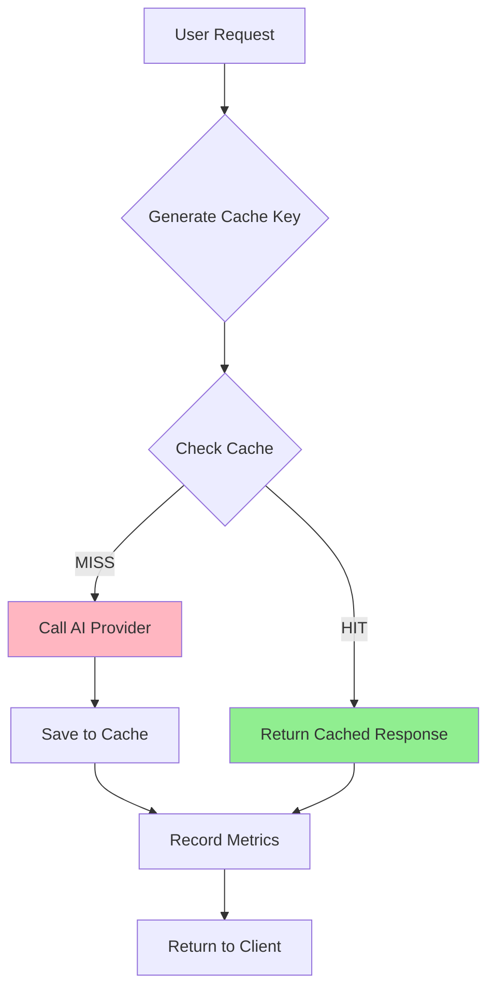

# AI Cost & Performance Optimization

**Version**: 1.0  
**Last Updated**: 2025-10-10  
**Purpose**: Document the caching strategy, cost tracking, and performance monitoring for the Welfare Footprint App's AI infrastructure.

---

## Table of Contents

1. [Overview](#overview)
2. [Caching Strategy](#caching-strategy)
3. [Cost Tracking](#cost-tracking)
4. [Performance Metrics](#performance-metrics)
5. [Privacy & Security](#privacy--security)
6. [Retention Policies](#retention-policies)
7. [Admin Controls](#admin-controls)
8. [Analytics Queries](#analytics-queries)
9. [Testing & Verification](#testing--verification)

---

## Overview

The AI infrastructure uses a **content-based caching system** to reduce costs and improve latency by avoiding redundant API calls to AI providers (currently Google Gemini). The system is designed with **privacy-first principles**, automatic invalidation, and comprehensive cost analytics.

### Key Features

- ✅ **Content-based cache keys**: SHA-256 hashes ensure no user-identifiable data is stored
- ✅ **Automatic invalidation**: Cache expires on prompt/model version changes
- ✅ **7-day TTL**: Cached responses auto-expire after 1 week
- ✅ **180-day metrics retention**: Historical performance tracking
- ✅ **Daily rollup aggregation**: Fast queries for trend analysis
- ✅ **Admin controls**: Flush cache, invalidate by prompt/model/key

---

## Caching Strategy

### Cache Key Generation

Cache keys are generated using a **SHA-256 hash** of the following components:

```
cache_key = SHA256(
  prompt_template_id +
  prompt_version +
  mode +
  language_family +
  image_hash +         // Perceptual hash of image content
  focus_item_canonical // (if applicable, normalized)
)
```

**Example components**:
- `prompt_template_id`: `"detect_items"`, `"analyze_product"`, `"analyze_focused_item"`
- `prompt_version`: `"v1.0"` (increment on prompt changes)
- `mode`: `"detect"`, `"analyze"`
- `language_family`: `"latin"`, `"cjk"`, `"indic"`, `"arabic"`, `"cyrillic"` (bucketed to reduce over-splitting)
- `image_hash`: First 64 bits of SHA-256 hash of base64 image data
- `focus_item_canonical`: Normalized (lowercase, diacritics removed) item name for focused analysis

### Cache Lifecycle



**Cache Hit Example**:
- User scans same product photo → Same `image_hash`
- Same mode (`detect`) + language family (`latin`) + prompt version (`v1.0`)
- Cache returns response in ~10ms instead of ~2000ms AI call

**Cache Miss Example**:
- Prompt version bumped from `v1.0` to `v1.1` → All prior cache entries invalid
- Different image (even same product) → Different `image_hash` → New cache entry

### Cache Strategies

The `AIRequest` object supports three cache strategies:

1. **`prefer` (default)**: Check cache first, call AI on miss
2. **`bypass`**: Skip cache lookup, always call AI (useful for debugging)
3. **`only`**: Only use cache, error if miss (not currently used in production)

### Auto-Invalidation

Cache entries are automatically invalidated when:
- **Prompt version changes**: Incrementing `PROMPT_VERSIONS` in `analyze-image/index.ts`
- **Model changes**: Switching from `gemini-2.0-flash-exp` to another model
- **7-day expiry**: Entries older than 7 days are auto-deleted
- **Admin action**: Manual flush via admin endpoint

---

## Cost Tracking

### Cost Estimation Formula

Cost is calculated per 1M tokens using current Gemini pricing:

```typescript
const COST_PER_1M_TOKENS = {
  'gemini-2.0-flash-exp': { 
    input: 0.075,  // $0.075 per 1M input tokens
    output: 0.30,  // $0.30 per 1M output tokens
  },
  'gemini-1.5-pro': { 
    input: 1.25, 
    output: 5.00 
  },
};

// Estimate (assuming 70% input, 30% output)
estimatedCost = 
  (totalTokens * 0.7 / 1_000_000) * pricing.input +
  (totalTokens * 0.3 / 1_000_000) * pricing.output;
```

**Example**:
- Gemini Flash: 1,500 tokens = `(1050 / 1M * 0.075) + (450 / 1M * 0.30) = $0.00007875 + $0.000135 = $0.00021375`
- ~0.02 cents per request

### Database Schema

**`ai_usage_metrics` table**:
```sql
CREATE TABLE public.ai_usage_metrics (
  id uuid PRIMARY KEY,
  timestamp timestamptz,
  provider text,
  model text,
  operation text,           -- 'detect', 'analyze', 'suggest_swap'
  latency_ms integer,
  tokens_used integer,
  cache_hit boolean,
  cache_key_hash text,
  estimated_cost_usd numeric(10, 8)
);
```

**`ai_metrics_daily_rollup` table** (for fast queries):
```sql
CREATE TABLE public.ai_metrics_daily_rollup (
  date date,
  provider text,
  model text,
  operation text,
  total_requests integer,
  cache_hits integer,
  cache_misses integer,
  hit_rate numeric(5, 4),   -- e.g., 0.7523 = 75.23%
  avg_latency_ms integer,
  p95_latency_ms integer,
  p99_latency_ms integer,
  total_tokens bigint,
  estimated_cost_usd numeric(12, 6),
  UNIQUE (date, provider, model, operation)
);
```

### Cost Visibility

- **Current**: Admin-only access to cost metrics (service role RLS)
- **Future (Plus users)**: Display aggregated usage counts (number of analyses this month)
- **Never**: Show individual USD costs to end-users

---

## Performance Metrics

### Tracked Metrics

For each AI request, the following are recorded:

- **Latency (ms)**: Total request time (including cache lookup)
- **Tokens used**: Input + output tokens (if available from provider)
- **Cache hit/miss**: Boolean flag
- **Provider/model**: AI service used
- **Operation**: `detect`, `analyze`, `suggest_swap`

### Daily Aggregation

The `aggregate_daily_metrics()` function computes:
- **Total requests**, **cache hits/misses**, **hit rate**
- **Avg/P95/P99 latency**
- **Total tokens** and **estimated cost**

**Run manually**:
```sql
SELECT public.aggregate_daily_metrics('2025-10-09');
```

**Automatic**: Nightly cron job (future enhancement, requires `pg_cron`)

### Performance Targets

| Metric | Target | Notes |
|--------|--------|-------|
| Cache hit rate | >70% | After warm-up period (2-3 weeks) |
| Avg latency (cached) | <50ms | Includes DB lookup |
| Avg latency (uncached) | <3000ms | Gemini API + network |
| P95 latency (uncached) | <5000ms | Acceptable for image analysis |

---

## Privacy & Security

### Privacy Guarantees

✅ **No user-identifiable data in cache**:
- Cache keys are SHA-256 hashes (one-way, irreversible)
- No user IDs, emails, or session tokens stored
- Image hashes are perceptual (content-based, not file metadata)

✅ **Global cache, user-agnostic**:
- Same product image = same cache entry for ALL users
- Cache is shared across users (cost savings benefit everyone)

✅ **Metrics anonymization**:
- `ai_usage_metrics` table contains **no user IDs**
- Only aggregated provider/model/operation data

✅ **Automatic expiration**:
- 7-day cache TTL prevents stale data
- 180-day metrics retention (configurable)

### Access Control

**Cache table (`ai_response_cache`)**:
- RLS enabled, **service role only**
- No client-side access (prevents cache poisoning)

**Metrics table (`ai_usage_metrics`)**:
- RLS enabled, service role write, admin read
- Future: Admin dashboard with role-based access

**Daily rollup table (`ai_metrics_daily_rollup`)**:
- Service role only (admin analytics)

---

## Retention Policies

### Cache Retention

- **TTL**: 7 days from creation
- **Cleanup**: Automatic via `trigger_ai_cleanup()` (1% probability on each cache insert)
- **Manual cleanup**: `SELECT public.cleanup_expired_cache();`

### Metrics Retention

- **TTL**: 180 days (6 months)
- **Cleanup**: Automatic via `trigger_ai_cleanup()` (1% probability on each cache insert)
- **Manual cleanup**: `SELECT public.cleanup_old_metrics();`

### Rollup Retention

- **TTL**: Indefinite (daily aggregates are small, <100 KB/year)
- **Manual cleanup**: Can delete old rollup rows if needed

---

## Admin Controls

### Cache Invalidation Endpoint

**Endpoint**: `POST https://[project-id].supabase.co/functions/v1/admin-cache-control`

**Actions**:

#### 1. Flush All Cache
```json
{
  "action": "flush_all"
}
```

#### 2. Invalidate by Prompt
```json
{
  "action": "invalidate_by_prompt",
  "promptTemplateId": "detect_items",
  "promptVersion": "v1.0"  // Optional: omit to invalidate all versions
}
```

#### 3. Invalidate by Model
```json
{
  "action": "invalidate_by_model",
  "model": "gemini-2.0-flash-exp"
}
```

#### 4. Invalidate by Cache Key
```json
{
  "action": "invalidate_by_key",
  "cacheKey": "a3f5c8d9e7b2a1c4f6d8e0b3a5c7d9e1..."
}
```

**Authorization**: Requires service role key (admin only)

---

## Analytics Queries

### 1. Current Cache Hit Rate
```sql
SELECT 
  ROUND(SUM(CASE WHEN cache_hit THEN 1 ELSE 0 END)::numeric / COUNT(*)::numeric, 4) as hit_rate,
  COUNT(*) as total_requests,
  SUM(CASE WHEN cache_hit THEN 1 ELSE 0 END) as cache_hits
FROM public.ai_usage_metrics
WHERE timestamp >= NOW() - INTERVAL '7 days';
```

### 2. Cost by Provider/Model (Last 30 Days)
```sql
SELECT 
  provider,
  model,
  COUNT(*) as requests,
  SUM(tokens_used) as total_tokens,
  SUM(estimated_cost_usd) as total_cost_usd,
  AVG(latency_ms) as avg_latency_ms
FROM public.ai_usage_metrics
WHERE timestamp >= NOW() - INTERVAL '30 days'
GROUP BY provider, model
ORDER BY total_cost_usd DESC;
```

### 3. Performance Trends (Daily)
```sql
SELECT 
  date,
  provider,
  model,
  total_requests,
  hit_rate,
  avg_latency_ms,
  p95_latency_ms,
  estimated_cost_usd
FROM public.ai_metrics_daily_rollup
WHERE date >= CURRENT_DATE - 30
ORDER BY date DESC, provider, model;
```

### 4. Most Cached Entries (Top 10)
```sql
SELECT 
  content_hash,
  prompt_template_id,
  prompt_version,
  model,
  hit_count,
  created_at,
  last_accessed_at
FROM public.ai_response_cache
ORDER BY hit_count DESC
LIMIT 10;
```

---

## Testing & Verification

### Manual Test Plan

**Test 1: Same Image Twice → HIT**
1. Upload product image → Analyze
2. Upload **same image** → Analyze again
3. **Expected**: Second request returns in <100ms with `X-Cache: HIT` header

**Test 2: Similar Image (pHash) → HIT**
1. Upload product image → Analyze
2. Upload **slightly compressed/resized** version of same image → Analyze
3. **Expected**: Second request returns `X-Cache: HIT` (perceptual hash matches)

**Test 3: Prompt Version Bump → MISS**
1. Upload image → Analyze (cache MISS, creates entry)
2. Increment `PROMPT_VERSIONS.detect_items` to `v1.1`
3. Upload **same image** → Analyze
4. **Expected**: Cache MISS (different prompt version), new entry created

**Test 4: Admin Invalidation**
1. Analyze multiple products → Build cache
2. Call admin endpoint: `{ "action": "invalidate_by_prompt", "promptTemplateId": "detect_items" }`
3. Analyze same products again
4. **Expected**: All MISS, cache refills

**Test 5: Metrics Dashboard**
1. Perform 10 analyses (mix of cached/uncached)
2. Query: `SELECT * FROM ai_usage_metrics ORDER BY timestamp DESC LIMIT 10;`
3. **Expected**: 10 rows with correct `cache_hit` boolean, latency, tokens

### Observability

**Check Cache Headers in Browser DevTools**:
```
Response Headers:
X-Cache: HIT  (or MISS)
```

**Check Edge Function Logs**:
```
Cache HIT: a3f5c8d9e7b2a1c4...
Metadata: { provider: 'gemini', model: 'gemini-2.0-flash-exp', latencyMs: 12, cacheHit: true }
```

---

## Future Enhancements

1. **Scheduled Daily Rollup**: Use `pg_cron` to run `aggregate_daily_metrics()` nightly
2. **User-Facing Usage Card**: Display "X analyses this month" for Plus users
3. **Cache Warming**: Pre-populate cache with common products
4. **Advanced Invalidation**: Invalidate by date range, hit count threshold
5. **Real-time Dashboard**: Grafana/Metabase for cost/latency monitoring

---

## Changelog

| Date | Version | Changes |
|------|---------|---------|
| 2025-10-10 | 1.0 | Initial implementation: cache tables, metrics tracking, admin controls |

---

## References

- [Supabase Functions Documentation](https://supabase.com/docs/guides/functions)
- [Google Gemini Pricing](https://ai.google.dev/pricing)
- [Privacy Data Flow](/docs/privacy_data_flow.md)
- [Testing Guide](/docs/testing_guide.md)

---

**Maintained by**: Welfare Footprint Project Team  
**Questions?**: Contact the development team or review edge function logs for debugging.
