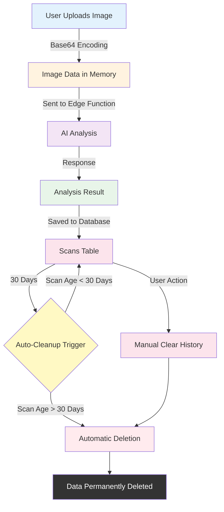

# Privacy & Data Flow Documentation

## Overview

This document outlines how the Welfare Footprint App handles user data, ensuring transparency, privacy, and compliance with data protection principles.

---

## Data Lifecycle



---

## 1. Data Collection

### 1.1 What Data We Collect

| Data Type | Purpose | Storage Location | Retention |
|-----------|---------|-----------------|-----------|
| **User Email** | Authentication, account management | `profiles` table | Until account deletion |
| **Product Images** | AI analysis (temporary) | Memory only (not persisted) | Cleared after analysis |
| **Image Base64** | Sent to AI provider | Edge function memory | Not stored |
| **Analysis Results** | Display to user, history tracking | `scans` table | 30 days (auto-cleanup) |
| **Preferences** | Language, ethical lens, notifications | `user_preferences` table | Until user updates or account deletion |
| **Favorites** | User-saved products | `favorites` table | Until user deletes or account deletion |

### 1.2 What Data We Do NOT Collect

- ❌ IP addresses
- ❌ Device identifiers (beyond browser defaults)
- ❌ Location data (GPS coordinates)
- ❌ Third-party tracking cookies
- ❌ Browsing history outside the app
- ❌ Personal health information
- ❌ Financial information

---

## 2. Data Flow Stages

### Stage 1: Image Upload (Client-Side)

**Process**:
1. User selects image via file input or camera
2. Image is read as Base64 string
3. MIME type is extracted (e.g., `image/jpeg`)
4. Image preview is generated for UI display
5. **No data is sent to server at this stage**

**Privacy Considerations**:
- Images are processed entirely in the browser
- No automatic upload or background sync
- User must explicitly click "Analyze" to proceed

---

### Stage 2: AI Analysis (Server-Side)

**Process**:
1. User clicks "Analyze Image"
2. Frontend calls Supabase Edge Function (`analyze-image`)
3. Edge function sends image (Base64) + prompt to AI provider (Gemini)
4. AI provider processes request and returns analysis
5. Edge function receives response

**Privacy Considerations**:
- Image data is transmitted over HTTPS (encrypted)
- AI provider (Google Gemini) processes image according to their privacy policy
- **Image is NOT stored permanently** — exists only in request/response memory
- Request includes user ID for authentication, but no personal identifiers in the image data
- AI provider does not retain images beyond the request lifecycle (per Gemini API terms)

**Third-Party Data Sharing**:
- **Google Gemini API**: Receives image + text prompt for analysis
  - Purpose: Generate welfare analysis
  - Data sent: Image (Base64), text prompt
  - Data NOT sent: User email, name, location
  - Retention: Google states images are not used to train models if using paid API

---

### Stage 3: Result Storage (Database)

**Process**:
1. Edge function returns analysis result to frontend
2. Frontend saves result to `scans` table in Supabase
3. Database row contains:
   - `user_id`: UUID (links to authenticated user)
   - `product_name`: Detected product name
   - `analysis_result`: JSONB (ingredients, welfare scores, confidence)
   - `welfare_category`: Text (overall category, e.g., "Moderate Concern")
   - `created_at`: Timestamp
   - `image_url`: NULL (images are not stored)

**Privacy Considerations**:
- **Row-Level Security (RLS)** ensures users can only access their own scans
- No personally identifiable information (PII) is stored in analysis results
- Product names may reveal dietary preferences but are anonymized from external access
- Database is hosted on Lovable Cloud (Supabase) with encryption at rest

**RLS Policy Example**:
```sql
CREATE POLICY "Users can view their own scans"
ON scans FOR SELECT
USING (auth.uid() = user_id);
```

---

### Stage 4: Data Retention (30-Day Lifecycle)

**Automatic Cleanup**:
- A database function runs periodically to delete scans older than 30 days
- Cleanup is triggered via:
  - **Option A**: Supabase Edge Function called by cron job
  - **Option B**: Database trigger on INSERT (piggyback approach)

**Implementation**:
```sql
-- Cleanup function
CREATE OR REPLACE FUNCTION delete_old_scans()
RETURNS void AS $$
BEGIN
  DELETE FROM scans
  WHERE created_at < NOW() - INTERVAL '30 days';
END;
$$ LANGUAGE plpgsql SECURITY DEFINER;
```

**Privacy Considerations**:
- Ensures data is not retained indefinitely
- Reduces risk of unauthorized access to historical data
- Complies with data minimization principles (GDPR, CCPA)

---

### Stage 5: Manual Deletion (User Control)

**"Clear History" Feature**:
- Located in Profile → Privacy Settings
- Allows users to immediately delete all their scans
- Requires confirmation dialog to prevent accidental deletion

**Implementation**:
```typescript
// Delete all scans for current user
const { error } = await supabase
  .from('scans')
  .delete()
  .eq('user_id', userId);
```

**Privacy Considerations**:
- Gives users full control over their data
- Deletion is immediate and permanent (no soft delete)
- Complies with "Right to Erasure" (GDPR Article 17)

---

### Stage 6: Account Deletion (Complete Removal)

**Process**:
1. User navigates to Profile → Privacy Settings
2. Clicks "Delete Account" button
3. Confirms deletion in alert dialog
4. All user data is deleted:
   - `profiles` table row
   - `scans` table rows (via RLS or cascade)
   - `user_preferences` table row
   - `favorites` table rows
5. User is signed out and redirected to home page

**Privacy Considerations**:
- Complete data removal (no orphaned records)
- Irreversible action (users are warned)
- Complies with "Right to Erasure"

---

## 3. Data Security Measures

### 3.1 Authentication & Authorization

- **Supabase Auth**: Industry-standard JWT-based authentication
- **Row-Level Security (RLS)**: Enforces user isolation at database level
- **API Key Protection**: AI API keys stored as Supabase secrets (not exposed to client)

### 3.2 Encryption

- **In Transit**: All data transmitted over HTTPS/TLS 1.3
- **At Rest**: Supabase database encrypted at rest (AES-256)
- **Secrets**: Environment variables encrypted via Supabase Vault

### 3.3 Access Control

- **Frontend**: Users can only access their own data (via RLS)
- **Edge Functions**: Service role key used sparingly, validated per request
- **Database**: No public read/write access without authentication

---

## 4. User Privacy Controls

### 4.1 Privacy Settings Page

**Located at**: Profile → Privacy Settings

**Features**:
1. **Anonymous Usage**: Toggle to opt out of aggregated analytics (if implemented)
2. **Notifications**: Enable/disable app notifications
3. **Clear History**: Delete all scan history immediately
4. **Delete Account**: Permanently remove all user data

### 4.2 Data Transparency

Users can view:
- **Scan History**: All past analyses with timestamps
- **Preferences**: Current language, ethical lens, notification settings
- **Account Info**: Email address, account creation date

---

## 5. Compliance & Best Practices

### 5.1 GDPR Compliance

| Principle | How We Comply |
|-----------|---------------|
| **Lawfulness** | Clear consent via account creation |
| **Purpose Limitation** | Data used only for welfare analysis |
| **Data Minimization** | Only necessary data collected (no tracking) |
| **Accuracy** | Users can update preferences anytime |
| **Storage Limitation** | 30-day auto-deletion policy |
| **Integrity & Confidentiality** | Encryption + RLS policies |
| **Accountability** | This documentation + audit logs |

### 5.2 CCPA Compliance

- **Right to Know**: Users can view all stored data in Profile
- **Right to Delete**: "Clear History" + "Delete Account" features
- **Right to Opt-Out**: Anonymous usage toggle (if analytics implemented)
- **No Sale of Data**: We do not sell or share user data with third parties

### 5.3 Ethical AI Usage

- **Transparency**: AI analysis is clearly labeled as AI-generated
- **Accuracy**: Confidence levels displayed to set user expectations
- **No Bias**: AI prompts designed to avoid cultural or dietary bias
- **Scientific Basis**: Welfare assessments reference Welfare Footprint Framework

---

## 6. Third-Party Data Processors

| Service | Purpose | Data Shared | Privacy Policy |
|---------|---------|-------------|----------------|
| **Lovable Cloud (Supabase)** | Database, authentication, hosting | User ID, email, analysis results | [Supabase Privacy](https://supabase.com/privacy) |
| **Google Gemini API** | AI image analysis | Image (Base64), text prompt | [Google AI Privacy](https://ai.google.dev/gemini-api/terms) |

**Note**: We do not use analytics tools (Google Analytics, Mixpanel, etc.) by default.

---

## 7. Data Breach Protocol

In the unlikely event of a data breach:

1. **Detection**: Monitor Supabase logs + security alerts
2. **Assessment**: Determine scope (which users, what data)
3. **Containment**: Revoke compromised API keys, reset passwords
4. **Notification**: Inform affected users within 72 hours (GDPR requirement)
5. **Remediation**: Patch vulnerabilities, update security policies
6. **Documentation**: Log incident for compliance audits

**Contact**: [Your security contact email]

---

## 8. User Rights Summary

As a user, you have the right to:

- ✅ **Access** your data (view scan history, preferences)
- ✅ **Rectify** your data (update email, preferences)
- ✅ **Erase** your data (clear history, delete account)
- ✅ **Restrict** processing (anonymous usage toggle)
- ✅ **Data Portability** (export scan history as JSON - future feature)
- ✅ **Withdraw Consent** (delete account at any time)

---

## 9. Privacy-First Design Decisions

### Why We Don't Store Images

**Decision**: Images are processed in memory and never saved to the database.

**Rationale**:
- Reduces storage costs
- Minimizes privacy risk (no historical image access)
- Complies with data minimization principles
- Faster performance (no image upload/retrieval overhead)

**Trade-off**: Users cannot re-view images from scan history (only results).

---

### Why 30-Day Retention

**Decision**: Scans are automatically deleted after 30 days.

**Rationale**:
- Balances user utility (access to recent scans) with privacy (data minimization)
- Reduces database bloat
- Aligns with GDPR storage limitation principle

**Trade-off**: Long-term trend analysis is not supported (by design).

---

## 10. Future Privacy Enhancements

**Planned Features**:
- [ ] **Export Data**: Download all scans as JSON (GDPR portability)
- [ ] **Anonymous Mode**: Analyze without saving to history
- [ ] **Data Retention Preferences**: Let users choose 7, 30, or 90-day retention
- [ ] **Audit Log**: Show users a log of all data access events
- [ ] **End-to-End Encryption**: Encrypt analysis results in database (client-side key)

---

## 11. Contact & Questions

For privacy-related questions or requests:
- **Email**: [Your privacy contact email]
- **Data Protection Officer**: [DPO name/email if applicable]
- **App Settings**: Profile → Privacy Settings

---

## Changelog

| Date | Change | Reason |
|------|--------|--------|
| 2025-01-XX | Initial documentation | Compliance & transparency |
| 2025-01-XX | Added 30-day auto-cleanup | Data minimization |
| 2025-01-XX | Added "Clear History" feature | User control |

---

**Last Updated**: [Current Date]
**Document Version**: 1.0
